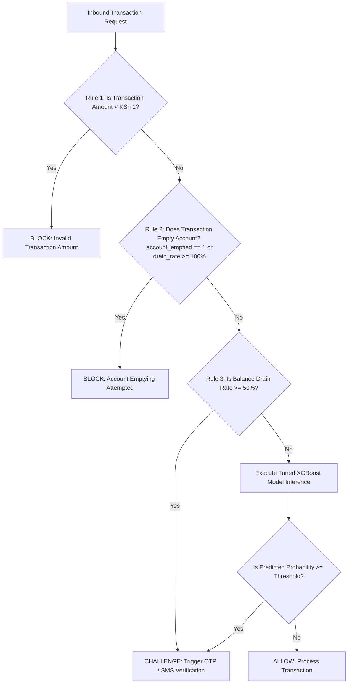

# 🛡️ M-Pesa Fraud Detection System

An end-to-end Machine Learning pipeline and real-time transaction decisioning framework designed to intercept and prevent fraudulent mobile money transactions in Kenya before settlement.

---

## 📌 Table of Contents
1. [Executive Summary & Goal](#-executive-summary--goal)
2. [Business & Economic Context](#-business--economic-context)
3. [Repository Structure](#-repository-structure)
4. [Dataset Specifications](#-dataset-specifications)
5. [Exploratory Data Analysis (EDA) Insights](#-exploratory-data-analysis-eda-insights)
6. [Feature Engineering Pipeline](#-feature-engineering-pipeline)
7. [Machine Learning Modeling & Tuning](#-machine-learning-modeling--tuning)
8. [Proposed Real-Time Decisioning Architecture](#-proposed-real-time-decisioning-architecture)
9. [Setup & Reproduction Guide](#-setup--reproduction-guide)

---

## 🎯 Executive Summary & Goal

Mobile money (primarily Safaricom's **M-Pesa**) is the central nervous system of the Kenyan economy, handling transactions for everything from micro-SMEs and local grocery shops (*mama mboga*) to utilities and mobile banking integrations. However, this dominance has made it a prime target for fraud networks deploying SIM swaps, social engineering, and fraudulent till/paybill merchant transactions.

Rather than auditing fraud retrospectively, this project designs a **real-time transaction decisioning engine** that sits between transaction initiation and completion. The system processes transaction features in milliseconds and returns one of three actions:

| Action | Condition | Response |
| :--- | :--- | :--- |
| **`ALLOW`** | Transaction exhibits standard, low-risk behavior. | Processed and settled immediately. |
| **`CHALLENGE`** | Transaction exhibits elevated risk or balance drain. | Intercepted; triggers OTP or secondary biometric verification. |
| **`BLOCK`** | Transaction triggers deterministic business rules or high ML risk. | Halted before settlement to protect wallet funds. |

---

## 📈 Business & Economic Context

M-Pesa operates at an unprecedented scale, making digital fraud a systemic economic risk in Kenya:

*   **Systemic Scale:** According to Safaricom's FY2024 Annual Report, M-Pesa processes **KSh 38.29 trillion annually** across **37.15 billion individual transactions**, representing the largest fintech ecosystem in Africa.
*   **High Financial Impact:** TransUnion's H2 2024 Consumer Pulse Study highlights that the median loss per digital scam in Kenya is **KSh 108,132**—the highest median financial loss recorded among surveyed African nations.
*   **Conservative Loss Baseline:** Applying a conservative network fraud rate of **0.006%** to M-Pesa’s transaction volume yields an estimated **KSh 2.30 billion (~$17.6 million USD)** in direct systemic losses annually.
    *   **Daily Drainage:** ~KSh 6.30 million stolen from users daily.
    *   **Hourly Drainage:** ~KSh 262,260 lost every hour.
    *   **Victim Count:** At the TransUnion median loss, this represents ~21,246 successful scam operations impacting Kenyan citizens annually.
*   **Socioeconomic Multipliers:** The real damage is higher due to underreporting of losses below KSh 5,000, secondary drainage of linked bank accounts, and small merchant business closures following fraud events.

---

## 📂 Repository Structure

The project workspace is organized into modular directories containing raw data, Jupyter notebooks for each pipeline stage, and visual reports:

```text
Mpesa-Fraud-Detection-System/
├── README.md                 # Project overview and documentation (This file)
├── Data/
│   ├── mpesa_synthetic.csv   # Raw synthetic transaction dataset
│   ├── Feature_engineered.csv# Full dataset with engineered features
│   ├── training.csv          # Stratified training split (109,915 rows)
│   └── evaluation.csv        # Stratified unseen evaluation set (10,000 rows)
├── Notebooks/
│   ├── EDA.ipynb             # Exploratory Data Analysis & Business Insights
│   ├── feature_engineering.ipynb # Data cleaning, time encoding, & features
│   └── modeling.ipynb        # Baseline models, SMOTE, & XGBoost tuning
└── Reports/
    ├── boxplot.png           # Statistical transaction distribution plot
    ├── fraud.png             # Visual dashboard of fraud insights
    ├── transactions.png      # Visual dashboard of overall transactions
    └── transactions.pbix     # Power BI Interactive Analytics Dashboard
```

---

## 📊 Dataset Specifications

*   **Source:** Synthetic M-Pesa Fraud Dataset (Kaggle).
*   **Dataset Dimensions:** 120,000 transactions × 13 features.
*   **Target Variable:** `is_fraud` (binary: 0 = legitimate, 1 = fraudulent).
*   **Fraud Prevalence:** 2.93% (3,510 fraudulent transactions)—intentionally inflated by ~490× relative to Safaricom's network average to allow machine learning models to learn minority class patterns.
*   **Key Features:** `amount`, `sender_balance_before`, `sender_balance_after`, `receiver_balance_before`, `receiver_balance_after`, `transaction_type` (peer/till/paybill), `hour`, `month_2026`, `day_of_week`, `device_type` (smartphone/feature), and `region`.

---

## 🔍 Exploratory Data Analysis (EDA) Insights

Detailed in the [EDA Notebook](file:///c:/Users/ngang/OneDrive/Desktop/Projects/Data Science/Mpesa-Fraud-Detection-System/Notebooks/EDA.ipynb) and visualized in the Power BI dashboard (`Reports/transactions.pbix`):

### 1. General Transaction Trends
*   **Volume & Outliers:** Transaction amounts are highly right-skewed. The majority of transactions fall between **KSh 0–2,000**, with a small number of high-value transfers reaching up to **KSh 18,750**.
*   **Temporal Peaks:** Transaction volume peaks at **4:00 AM** (5,151 transactions) and Monday is the busiest day of the week (17,408 transactions). *Note: The 4:00 AM peak is a synthetic data artifact and deviates from real-world usage patterns.*
*   **Regional & Device Uniformity:** Transactions are distributed near-uniformly across Kenyan regions (Nairobi, Mombasa, Kisumu, Nakuru, Eldoret) and device types (feature phones vs. smartphones), typical of synthetic distributions.

### 2. Fraud Characteristics & Deterministic Signals
*   **High-Value Targeting:** Fraudulent transactions are on average **72% higher in value** than legitimate ones. The mean transaction value is **KSh 2,535.00 for fraud** vs. **KSh 1,475.81 for legitimate** transactions.
*   **The Balance Drain Cliff:** Legitimate transactions cluster near zero, with a median balance drain of **2.89%**. Fraudulent transactions show a median balance drain of **119.32%**.
*   **Fraud Risk by Balance Drain:**
    *   **0% – 50% Drain:** ~1% Fraud Rate (Recommended Action: `ALLOW`)
    *   **50% – 100% Drain:** ~12% Fraud Rate (Recommended Action: `CHALLENGE`)
    *   **>100% Drain (Exceeds Balance):** 100% Fraud Rate (Recommended Action: `BLOCK`)
*   **Deterministic Zero-Balance Signal:** In the dataset, **2,071 transactions resulted in the sender's account balance being reduced to zero or below. Every single one of these transactions was fraudulent (100% fraud rate).** This indicates that fully emptying an account is a deterministic rule that can bypass model inference to trigger an automatic block.

---

## 🛠️ Feature Engineering Pipeline

Detailed in the [Feature Engineering Notebook](file:///c:/Users/ngang/OneDrive/Desktop/Projects/Data Science/Mpesa-Fraud-Detection-System/Notebooks/feature_engineering.ipynb):

1.  **Noise Filtering:**
    *   Dropped transactions with an amount of 0.
    *   Dropped transactions below **KSh 1** since the minimum transactable amount on Safaricom's M-Pesa is KSh 1. Training on impossible values overfits models to synthetic noise.
2.  **Cyclic Temporal Encoding:**
    *   Time-series attributes (`hour`, `month_2026`, and `day_of_week`) are linear but represent continuous cycles. To allow models to recognize that hour `23` and hour `0` are adjacent, we encoded them using Sine and Cosine transformations:
        $$\text{time\_sin} = \sin\left(\frac{2\pi \times \text{value}}{\text{max\_val}}\right), \quad \text{time\_cos} = \cos\left(\frac{2\pi \times \text{value}}{\text{max\_val}}\right)$$
3.  **Derived Behavioral Features:**
    *   `drain_rate`: Calculates the percentage of the sender's wallet emptied: `(amount / sender_balance_before) * 100`.
    *   `account_emptied`: Binary flag (`1` or `0`) indicating whether the transaction amount meets or exceeds the sender's available balance.
4.  **Data Isolation:**
    *   To prevent data leakage, a stratified test split of **10,000 transactions** was carved out as `Data/evaluation.csv` before any preprocessing or scaling.

---

## 🤖 Machine Learning Modeling & Tuning

Detailed in the [Modeling Notebook](file:///c:/Users/ngang/OneDrive/Desktop/Projects/Data Science/Mpesa-Fraud-Detection-System/Notebooks/modeling.ipynb):

### 1. Preprocessing Decisions
*   **Nominal Categorical Encoding:** One-Hot Encoding applied to `region` (5 categories) and `transaction_type` (3 categories).
*   **Binary Encoding:** `device_type` mapped to `0` (smartphone) and `1` (feature phone).
*   **Feature Scaling:** Applied `StandardScaler` only to Logistic Regression. Tree-based ensemble models (Random Forest, XGBoost, LightGBM) are scale-invariant.

### 2. Base Model Performance (Class Imbalance via Class Weighting)
Because of the heavy class imbalance, **Accuracy** is an unreliable metric (a dummy model guessing "Not Fraud" achieves 97% accuracy). We optimize for **Recall** to minimize missed fraud (False Negatives), accepting minor trade-offs in **Precision** (False Positives).

Base classifiers were trained on identical splits with balanced loss functions:

| Model | Baseline Recall (Fraud) | Baseline Precision (Fraud) | Baseline F1-Score | Baseline Accuracy |
| :--- | :---: | :---: | :---: | :---: |
| **Logistic Regression** | 0.47 | 0.03 | 0.05 | 0.52 |
| **Random Forest** | 0.54 | 0.03 | 0.06 | 0.47 |
| **LightGBM** | 0.62 | 0.03 | 0.06 | 0.41 |
| **XGBoost** | **0.62** | 0.03 | 0.06 | 0.41 |

*Note: Logistic Regression struggled to capture the sharp, non-linear decision boundary of the `drain_rate` threshold. XGBoost and LightGBM performed best, capturing 62% of fraudulent cases.*

### 3. Hyperparameter Tuning & Optimisation
XGBoost was selected for hyperparameter tuning. Instead of fixed class weighting, we integrated **SMOTE (Synthetic Minority Over-sampling Technique)** inside a cross-validation pipeline.
*   **Leakage Avoidance:** Wrapping SMOTE and XGBoost inside `imblearn.pipeline.Pipeline` ensured that synthetic oversampling was only applied to training folds during `fit` and never leaked into evaluation folds during `predict`.
*   **Tuning Strategy:** Exhaustive parameter search via `GridSearchCV` evaluated across 5-folds optimizing for recall.
*   **Best Parameters Found:**
    ```python
    {
        'model__colsample_bytree': 0.5,
        'model__learning_rate': 0.01,
        'model__max_depth': 4
    }
    ```
*   **Tuned Model Results:**
    *   **Tuned XGBoost Recall:** **0.68** (Caught 68% of fraud cases, an **10% improvement** over the baseline XGBoost).
    *   **Tuned XGBoost Precision:** **0.03** (Remained low due to the uniform synthetic fraud distribution across categories).

---

## 🔌 Proposed Real-Time Decisioning Architecture

In a production environment, machine learning models should not run in isolation. A hybrid architecture combining **Deterministic Business Rules (Hard Rules)** and **Probabilistic Machine Learning Models (Soft Rules)** yields the most secure and low-latency API decisioning engine (e.g., via FastAPI):



### Advantages of This Hybrid Pipeline:
1.  **Zero-Latency Bypass:** Deterministic blocks (e.g., account emptying or negative balance requests) bypass model inference entirely, saving compute resources and reducing API response latency.
2.  **Layered Defense:** Catches 100% of the extreme balance-draining transactions via simple, explainable SQL/Python rules, while relying on the tuned XGBoost model to detect subtle, non-linear transactional anomalies.

---

## 🚀 Setup & Reproduction Guide

### Prerequisites
*   Python 3.10+
*   Anaconda or `venv` package manager

### 1. Clone the Repository & Initialize Environment
```bash
# Navigate to project directory
cd Mpesa-Fraud-Detection-System

# Create virtual environment
conda create -n mpesa-fraud python=3.10 -y
conda activate mpesa-fraud
```

### 2. Install Required Dependencies
```bash
pip install pandas numpy scikit-learn xgboost lightgbm imbalanced-learn joblib matplotlib seaborn plotly
```

### 3. Execution Order
To reproduce the datasets, visualizations, and models, run the notebooks in the following order:
1.  **Run [Notebooks/EDA.ipynb](file:///c:/Users/ngang/OneDrive/Desktop/Projects/Data Science/Mpesa-Fraud-Detection-System/Notebooks/EDA.ipynb)**: Performs analysis on raw data, generates statistical distributions, and saves PNG reports to the `Reports/` directory.
2.  **Run [Notebooks/feature_engineering.ipynb](file:///c:/Users/ngang/OneDrive/Desktop/Projects/Data Science/Mpesa-Fraud-Detection-System/Notebooks/feature_engineering.ipynb)**: Cleans the data, applies cyclic time encoding, creates behavioral metrics, and outputs the engineered datasets (`training.csv` and `evaluation.csv`).
3.  **Run [Notebooks/modeling.ipynb](file:///c:/Users/ngang/OneDrive/Desktop/Projects/Data Science/Mpesa-Fraud-Detection-System/Notebooks/modeling.ipynb)**: Trains the baseline models, runs the grid search with SMOTE cross-validation, and selects/tunes the final XGBoost model.
